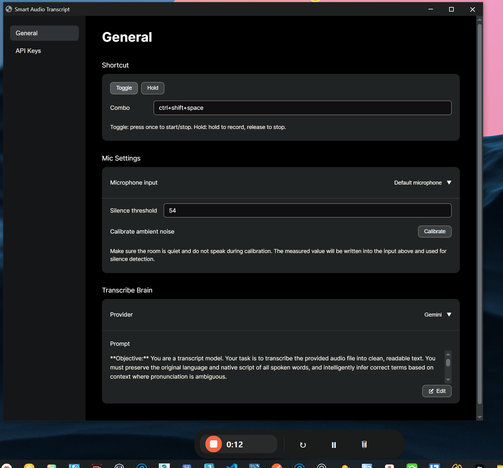

# 🎤 Smart Audio Transcript

> **Turn your voice into text with AI-powered transcription**

A modern, feature-rich speech-to-text application that combines the power of Google's Gemini AI with a beautiful web interface and floating recording controls. Perfect for content creators, developers, students, and anyone who needs fast, accurate transcription.



## ✨ Features

### 🎯 **Smart Recording**
- **One-click recording** with customizable hotkeys
- **Silence detection** that automatically stops when you're done speaking
- **Pause & resume** without losing your audio
- **Multiple microphones** support with easy device switching

### 🤖 **AI-Powered Transcription**
- **Google Gemini AI** for accurate, context-aware transcription
- **Multi-language support** - preserves original scripts (English, Arabic, etc.)
- **Smart error correction** that understands context and technical terms
- **Customizable AI prompts** for specialized use cases

### 🖥️ **Modern Interface**
- **Beautiful web UI** with dark theme and responsive design
- **Floating recording overlay** that stays on top while you work
- **System tray integration** for background operation
- **Real-time status** and audio feedback

### ⚡ **Productivity Features**
- **Auto-paste** transcribed text directly to your active application
- **Global hotkeys** - record from anywhere without switching windows
- **Background operation** - keeps running in system tray
- **Instant restart** - discard and start fresh recording

## 🚀 Quick Start

### 1. Install Dependencies
```bash
pip install -r requirements.txt
```

### 2. Get Your API Key
- Get a free [Google Gemini API key](https://makersuite.google.com/app/apikey)

### 3. Run the App
```bash
python main.py
```

### 4. Add Your API Key (in the app)
1) In the left sidebar, click `API Keys`  
2) Paste your key into the `Gemini API Key` field  
3) The key is saved automatically (you can change it anytime)

Tip: Alternatively, you can create a `.env` file with `GEMINI_API_KEY=your_key`.


## 🎮 How It Works

1. **Start Recording** - Click the button or use your hotkey
2. **Speak Naturally** - The floating overlay shows recording status
3. **Auto-Stop** - Recording stops when you finish speaking
4. **AI Processing** - Gemini AI transcribes with context awareness
5. **Auto-Paste** - Text appears in your active application

## 🛠️ Configuration

### Hotkeys
- **Toggle Mode**: Press once to start/stop (default: `Ctrl+Shift+Space`)
- **Hold Mode**: Hold to record, release to stop (default: `Ctrl`)

### Audio Settings
- **Silence Threshold**: Adjust sensitivity for your environment
- **Microphone Selection**: Choose your preferred input device
- **Ambient Calibration**: Automatic noise floor detection

### AI Customization
- **Custom Prompts**: Tailor transcription for your specific needs
- **Language Preservation**: Maintains original scripts and accents
- **Error Correction**: Context-aware fixes for technical terms


## 🏗️ Architecture

Smart Audio Transcript uses a modern hybrid architecture:

- **🌐 Web Interface** (Eel) - Settings and configuration
- **🎯 Native Overlay** (CustomTkinter) - Floating recording controls  
- **🗂️ System Tray** (pystray) - Background management
- **🎤 Core Engine** (Python) - Audio processing & AI integration

This gives you the best of both worlds: a modern web UI for settings and responsive native controls for recording.

## 🎯 Use Cases

### 👨‍💻 **Developers**
- Code documentation and comments
- Meeting notes and brainstorming
- Technical documentation

### 📝 **Content Creators**
- Video subtitles and captions
- Podcast transcription
- Blog post drafting

### 🎓 **Students**
- Lecture notes and study materials
- Research documentation
- Assignment writing

### 💼 **Professionals**
- Meeting minutes and action items
- Email drafting
- Report writing

## 🔧 Advanced Features


## 🤝 Contributing

We welcome contributions! Here's how you can help:

1. **Fork** the repository
2. **Create** a feature branch (`git checkout -b feature/amazing-feature`)
3. **Commit** your changes (`git commit -m 'Add amazing feature'`)
4. **Push** to the branch (`git push origin feature/amazing-feature`)
5. **Open** a Pull Request

### Development Setup
```bash
git clone https://github.com/yourusername/smart-audio-transcript.git
cd smart-audio-transcript
pip install -r requirements.txt
python main.py
```

## 📄 License

This project is licensed under the MIT License - see the [LICENSE](LICENSE) file for details.

## 🙏 Acknowledgments

- **Google Gemini AI** for powerful transcription capabilities
- **Eel** for the modern web interface framework
- **CustomTkinter** for beautiful native overlays
- **pystray** for seamless system tray integration


---

**Made with ❤️ for the open source community**

*Transform your voice into text with the power of AI*
